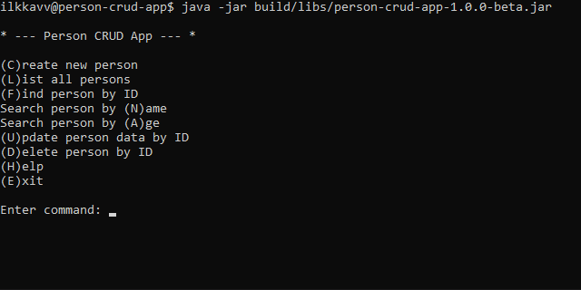

# Person CRUD app


## 📑 Table of Contents

- [Person CRUD app](#person-crud-app)
  - [📑 Table of Contents](#-table-of-contents)
  - [📝 Description](#-description)
  - [✨ Current Features](#-current-features)
  - [🎓 How to Use](#-how-to-use)
    - [Creating a person](#creating-a-person)
    - [Listing persons](#listing-persons)
    - [Finding a person](#finding-a-person)
    - [Updating a person](#updating-a-person)
    - [Deleting a person](#deleting-a-person)
    - [Repository option](#repository-option)
  - [📖 About](#-about)
  - [🏗️ Architecture](#️-architecture)
    - [Components](#components)
    - [Design Principles](#design-principles)
  - [🧰 How to Compile and Run](#-how-to-compile-and-run)
    - [❗ Requirements](#-requirements)
    - [Clone the repository](#clone-the-repository)
    - [Compile](#compile)
    - [Run](#run)
    - [Run with in-memory repository](#run-with-in-memory-repository)
  - [🧠 AI Usage](#-ai-usage)
  - [📄 License](#-license)

## 📝 Description

**Person CRUD App** is a simple command-line application for managing a collection of persons. It supports basic CRUD
operations (create, read, update, delete) and is built using a clean layered architecture with a controller, repository
abstraction, and custom data structures. Data can be stored either in memory or in a CSV file.



## ✨ Current Features

- CLI-based CRUD operations for managing persons
- Search persons by name (case-insensitive) or by age range
- Sort results by name or age (supports ascending and descending order)
- Input validation for name and age
- Supports both CSV-based and in-memory data storage
- Clean layered architecture with controller and repository abstraction
- Automatic ID generation
- Result wrapper classes for handling success and validation errors
- Custom list implementation (MyArrayList)
- Custom exception handling for CSV repository errors

## 🎓 How to Use

When the application starts, it opens an interactive command-line menu.  
You can choose an operation by entering either the full command or its short form shown in parentheses.  
The application guides the user with prompts and validation messages during input.

Available commands:

- `c` or `create` – create a new person
- `l` or `list` – list all persons
- `f` or `find` – find a person by ID
- `n` or `name` – search persons by name
- `a` or `age` – search persons by age range
- `u` or `update` – update a person by ID
- `d` or `delete` – delete a person by ID
- `h` or `help` – show help information
- `e` or `exit` – exit the application

### Creating a person

Choose `create` and enter:

- first name
- last name
- age

The application automatically assigns a unique ID to the new person.

### Listing persons

Choose `list` to display all stored persons.

### Finding a person

Choose `find` and enter a person ID to view that person's details.

### Searching for persons

Choose `name` to search by first or last name (case-insensitive),  
or `age` to search within a specified age range.

### Sorting results

After listing or searching persons, the application allows sorting the results interactively by:

- first name
- last name
- age

Both ascending and descending order are supported.

### Updating a person

Choose `update` and enter the ID of the person you want to modify.  
Then enter the new first name, last name, and age.

### Deleting a person

Choose `delete` and enter the ID of the person you want to remove.

### Repository option

By default, the application uses a CSV-based repository for persistent storage.  
You can also run the application with an in-memory repository:

```bash
java -jar person-crud-app.jar --repo=mem
```

> [!IMPORTANT]
> In-memory mode does not save data after the program exits.

## 📖 About

This project is developed as part of an **Object-Oriented Programming** course at **Tampere University of Applied
Sciences (TAMK)**.

The goal of the project is to apply core object-oriented programming principles in practice by designing and
implementing a small but structured application. The project focuses on concepts such as classes and objects,
encapsulation, abstraction, and the use of interfaces.

The application is built using a clean layered architecture, separating the user interface, controller, and data access
logic. It also includes custom data structures and interchangeable repository implementations to support maintainability
and extensibility.

Through this project, the aim is to develop skills in writing clear, maintainable, and well-structured code while
following common software development practices.

## 🏗️ Architecture

**Person CRUD app** follows a layered architecture with clear separation of concerns:

UI → Controller → Repository → MyList (MyArrayList / MyLinkedList)

The architecture allows switching between different UI and repository implementations without modifying other layers.

### Components

- **UI**
  - Handles user interaction
  - Reads input and displays output

- **Controller**
  - Acts as an intermediary between UI and repository
  - Contains application logic
  - Ensures separation between layers

- **Repository**
  - Responsible for data access and persistence
  - Two implementations:
    - CSV-based repository (persistent storage)
    - In-memory repository (for testing)

- **Data Structure**
  - Custom list implementation
  - Used to store and manage Person objects
  - The implementation can be easily replaced without affecting other parts of the application

### Design Principles

- Separation of concerns between layers
- Use of interfaces to allow interchangeable implementations
- Loose coupling between components
- Easy to extend with new UI or repository implementations

## 🧰 How to Compile and Run

### ❗ Requirements

- **Java 25** (tested)
- No separate **Gradle** installation required (**Gradle Wrapper** included)

### Clone the repository

```bash
git clone https://github.com/ilkkavv/person-crud-app
cd person-crud-app
```

### Compile

```bash
./gradlew clean build
```

### Run

```bash
java -jar build/libs/person-crud-app-1.0.0-beta.jar
```

The application runs as an interactive CLI and will prompt for user input.

### Run with in-memory repository

```bash
java -jar build/libs/person-crud-app-1.0.0-beta.jar --repo=mem
```

---

> [!NOTE]
> Alternatively, download the pre-built JAR from the GitHub Releases page.

## 🧠 AI Usage

**ChatGPT** (OpenAI GPT-5.3) was used during this project primarily as a learning aid. The tool was utilized to clarify
course concepts, assist with understanding error messages, and improve the quality of documentation (README, code
comments, and commit messages).

AI was not used to generate code, but rather to support learning and enhance documentation quality.

## 📄 License

This project is licensed under the **GNU General Public License v3.0 (GPL-3.0)**.

You are free to use, modify, and distribute this project, provided that any
derivative work is also distributed under the same license.

See the [LICENSE](LICENSE) file for details.
