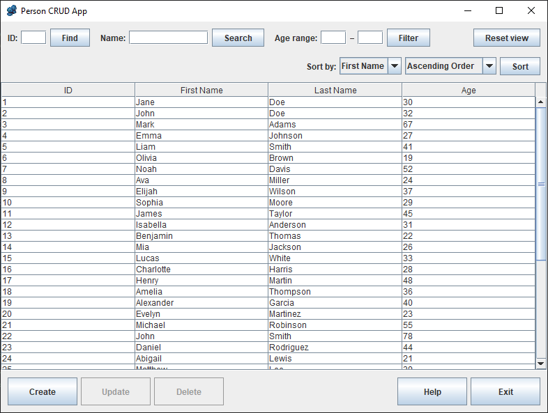
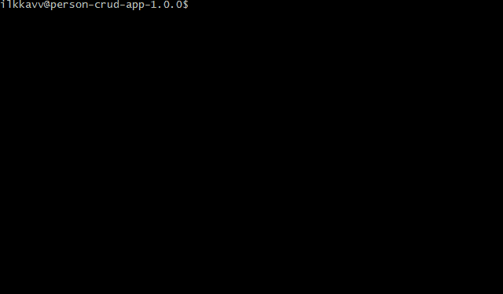
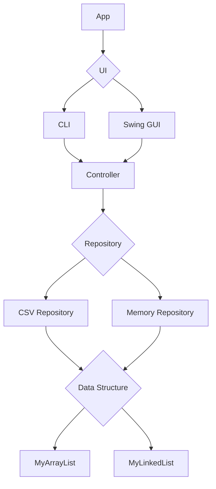

# 👥 Person CRUD App


## Table of Contents

- [👥 Person CRUD App](#-person-crud-app)
  - [Table of Contents](#table-of-contents)
  - [Description](#description)
  - [Screencast](#screencast)
  - [Features](#features)
  - [Usage](#usage)
  - [About](#about)
  - [Architecture](#architecture)
    - [Application Layers](#application-layers)
    - [Design Principles](#design-principles)
    - [Error Handling and Logging](#error-handling-and-logging)
    - [Scope and Simplifications](#scope-and-simplifications)
  - [How to Compile and Run](#how-to-compile-and-run)
    - [❗ Requirements](#-requirements)
    - [Clone the repository](#clone-the-repository)
    - [Build the application](#build-the-application)
    - [Extract the distribution package](#extract-the-distribution-package)
    - [User Interface Options](#user-interface-options)
      - [Swing GUI (default)](#swing-gui-default)
      - [Command-Line Interface](#command-line-interface)
    - [Repository Options](#repository-options)
    - [Running Unit Tests](#running-unit-tests)
  - [Releases](#releases)
  - [Learning resources](#learning-resources)
  - [AI Usage](#ai-usage)
  - [License](#license)

## Description

**Person CRUD App** is a Java application for managing a collection of persons through either a command-line interface
(CLI) or a graphical user interface (Swing GUI). The application supports full CRUD operations (create, read, update,
delete), searching, filtering, sorting, validation, and structured error handling.

The project is built using a clean layered architecture with separate UI, controller, and repository layers. Data can be
stored either persistently in a CSV file or temporarily in memory through interchangeable repository implementations.

The application also includes custom data structures, centralized validation and exception handling, and
**Log4j2**-based logging support. The architecture is designed to be modular, extensible, and easy to maintain while
demonstrating separation of concerns and object-oriented design principles.

---

**Graphical User Interface:**  



---

**Command-Line Interface:**



---

## Screencast

🎞️ [Watch screencast on YouTube](https://www.youtube.com/watch?v=1jkjOgXCP0Q&feature=youtu.be)

## Features

- Manage persons using either a Swing GUI or a command-line interface
- Create, view, update, and delete person records
- Search persons by ID or name
- Filter persons by age range
- Sort results by first name, last name, or age
- Supports both ascending and descending sorting
- Persistent CSV-based storage
- Optional in-memory repository mode
- Input validation with user-friendly error messages
- Validation highlighting and dialogs in the GUI
- Logging support and repository error handling

## Usage

By default, the application starts with the Swing-based graphical user interface.  
A command-line interface is also available through a startup option.

The application allows you to:

- Create new persons
- View all stored persons
- Find persons by ID or search by name
- Filter persons by age range
- Sort results by first name, last name, or age
- Update existing persons
- Delete persons
- View validation and error messages during input

Person records consist of:

- ID (generated automatically)
- First name
- Last name
- Age

## About

This project is developed as part of an **Object-Oriented Programming** course at **Tampere University of Applied
Sciences (TAMK)**.

The goal of the project is to apply core object-oriented programming principles in practice by designing and
implementing a structured application. The project focuses on concepts such as classes and objects, encapsulation,
abstraction, interfaces, layered architecture, validation, and exception handling.

The application is built using a clean layered architecture that separates the user interface, controller, and data
access logic. It includes both Swing GUI and command-line interface implementations, interchangeable repository
implementations, custom data structures, validation layers, and centralized error handling to support maintainability
and extensibility.

Through this project, the aim is to develop skills in writing clear, maintainable, and well-structured code while
following common software development practices such as modular design, logging, documentation, and version control.

## Architecture

**Person CRUD App** follows a layered architecture with clear separation of concerns:



The application is designed so that user interfaces and repository implementations can be changed without modifying the
core application logic.

### Application Layers

- Application entry point

  - Parses startup options
  - Selects the UI implementation
  - Selects the repository implementation
  - Starts the application
  
- UI layer

  - Contains both the Swing GUI and CLI implementations
  - Handles user interaction and displays results
  - Delegates application logic to the controller
  - Uses shared UI abstraction through `AppUi`
  
- Controller layer

  - Coordinates application operations
  - Validates input before repository access
  - Returns structured result objects to the UI
  - Keeps UI code separated from repository logic
  
- Repository layer

  - Provides data access through the `PersonRepository` interface
  - Includes CSV-based persistent storage
  - Includes in-memory storage for temporary use
  - Hides persistence details from the controller
  
- Model layer

  - Contains the person-related data objects
  - Separates input data from stored entities
  
- Validation layer

  - Provides structured validation errors
  - Identifies invalid fields using typed validation objects
  - Allows both CLI and GUI to display validation errors consistently
  
- Data structure layer

  - Contains custom list implementations
  - Provides a shared `MyList` abstraction
  - Includes array-based and linked-list-based implementations
  - `MyArrayList` is currently used as the default implementation because  
    the application frequently relies on index-based access and sorting operations

### Design Principles

- Separation of concerns between layers
- Interface-based design for interchangeable implementations
- Loose coupling between UI, controller, and repository
- Encapsulation of internal repository data
- Structured validation instead of plain error strings
- Centralized exception handling for technical failures

### Error Handling and Logging

The application separates expected application-level failures from technical failures.

Expected failures, such as validation errors or missing persons, are returned from the controller as structured result
objects. This allows both the CLI and GUI to display errors consistently without depending on repository details.

The CSV repository also validates the structure of the CSV file. Invalid CSV headers and duplicate person IDs are
detected during repository loading and reported as repository errors.

The application assumes that CSV data is managed through the application itself. Manual external modification
of the CSV file may still introduce unsupported or malformed data.

Technical failures, such as CSV read/write errors or invalid CSV content, are handled with custom repository exceptions.
These errors are logged using **Log4j2** and shown to the user through CLI error messages or GUI dialogs.

### Scope and Simplifications

The application uses a deliberately simple person model focused on demonstrating application architecture, validation,
repository abstraction, and user interface design.

A more production-oriented implementation could include additional fields such as email addresses, phone numbers, or
physical addresses. Age is currently stored directly as an integer value, whereas a more robust solution would typically
store a birthdate and calculate the age dynamically.

The simplified model allowed the project to focus more on software structure, maintainability, and separation of
concerns.

The CSV repository prioritizes simplicity and data consistency over performance by reloading the CSV file before
repository operations.

## How to Compile and Run

### ❗ Requirements

- **Java 25** (tested)
- No separate **Gradle** installation required (**Gradle Wrapper** included)

### Clone the repository

```bash
git clone https://github.com/ilkkavv/person-crud-app
cd person-crud-app
```

### Build the application

```bash
./gradlew distZip
```

The generated ZIP package can be found in:

`build/distributions/`

### Extract the distribution package

Extract the generated ZIP file:

`person-crud-app-<version>.zip`

After extraction, open a terminal in the root directory of the extracted package.

### User Interface Options

> [!NOTE]
> Run the startup scripts from the root directory of the distribution package.
> This ensures that the `data` and `logs` directories are created in the correct location.

#### Swing GUI (default)

Start the graphical user interface:

**Linux / macOS**

```bash
./bin/person-crud-app
```

**Windows**

```cmd
bin\person-crud-app.bat
```

#### Command-Line Interface

Start the command-line interface:

**Linux / macOS**

```bash
./bin/person-crud-app --ui=cli
```

**Windows**

```cmd
bin\person-crud-app.bat --ui=cli
```

### Repository Options

By default, the application uses CSV-based persistent storage and stores data in the `data` directory.

You can also run the application using an in-memory repository:

**Linux / macOS**

```bash
./bin/person-crud-app --repo=mem
```

**Windows**

```cmd
bin\person-crud-app.bat --repo=mem
```

> [!IMPORTANT]
> In-memory mode does not save data after the program exits.

The options can also be combined:

**Linux / macOS**

```bash
./bin/person-crud-app --repo=mem --ui=cli
```

**Windows**

```cmd
bin\person-crud-app.bat --repo=mem --ui=cli
```

> [!NOTE]
> Alternatively, download the pre-built distribution ZIP package from the
> [GitHub Releases page](https://github.com/ilkkavv/person-crud-app/releases).

### Running Unit Tests

Automated unit tests can be run with Gradle:

```bash
./gradlew test
```

The current test suite focuses on the in-memory repository implementation, `MemPersonRepository`.

The tests verify core repository behavior such as creating, reading, updating, deleting, searching, ID generation, and
protecting the repository's internal list from external modification. They focus on validating repository behavior
independently of the user interface and controller layers.

The tests are located under `src/test/java/`.

Gradle uses **JUnit Jupiter** for running the tests. The tests are also executed automatically when running the standard
Gradle build task.

## Releases

Project versions follow semantic versioning (MAJOR.MINOR.PATCH) and are published using **GitHub Releases**.

Each release represents a milestone in the development process:

- 1.0.0-alpha – Initial MVP
- 1.0.0-beta – Feature improvements
- 1.0.0-rc – Release candidate
- 1.0.0 – Final version

Pre-built distribution packages are available on the
[GitHub Releases page](https://github.com/ilkkavv/person-crud-app/releases).

## Learning resources

This project was primarily developed based on course lectures and previous assignments. In addition, the following
external resources were used to support learning Java Swing development, layouts, event handling, and exception
handling:

- [A Visual Guide to Layout Managers](https://docs.oracle.com/javase/tutorial/uiswing/layout/visual.html)
- [How to Write Window Listeners](https://docs.oracle.com/javase/tutorial/uiswing/events/windowlistener.html)
- [JavaSpring.net](https://www.javaspring.net/blog/java-exceptions-handling-exceptions-without-try-catch/#1-understanding-the-problem-with-traditional-try-catch-in-swing)
- [Stack Overflow](https://stackoverflow.com)

## AI Usage

**ChatGPT** (OpenAI GPT-5.3) was used during this project primarily as a learning aid. The tool was utilized to clarify
course concepts, assist with understanding error messages, and improve the quality of documentation (README, code
comments, and commit messages).

In addition, AI was used to study Java Swing and explore available Swing components and features, including how
different GUI elements and event-handling mechanisms work in practice.

## License

This project is licensed under the **GNU General Public License v3.0 (GPL-3.0)**.

You are free to use, modify, and distribute this project, provided that any
derivative work is also distributed under the same license.

See the [LICENSE](LICENSE) file for details.
